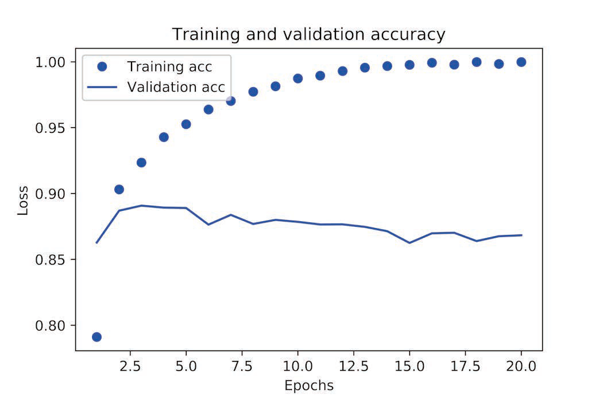
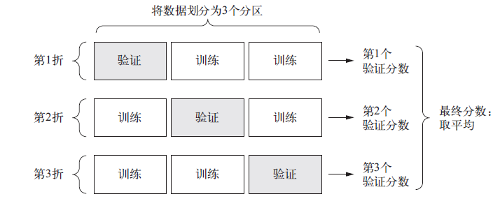

# Keras学习笔记

# 一、基本概念

## 1 层的概念

&emsp;&emsp;**简单的向量数据**保存在形状为`(samples, features)` 的**2D** **张量**中，通常用**密集连接层**［densely connected layer，也叫全连接层（fully connected layer）或密集层（dense layer），对应于`Keras` 的`Dense` 类］来处理。**序列数据**保存在形状为`(samples, timesteps, features) `的**3D** **张量**中，通常用循环层（recurrent layer，比如`Keras` 的`LSTM `层）来处理。**图像数据**保存在**4D 张量**中，通常用二维卷积层（`Keras` 的`Conv2D`）来处理。

```python
from keras import models
from keras import layers
# 模型中添加的层都会自动匹配输入层的形状
model = models.Sequential()
model.add(layers.Dense(32, input_shape=(784,)))
model.add(layers.Dense(32)) # 输入神经元数量为上一层的输出数量
```

## 2 损失值与优化器

&emsp;&emsp;对于**二分类问题**，可以使用**二元交叉熵**（`binary_crossentropy`）损失函数；对于**多分类问题**，可以用**分类交叉熵**（`categorical_crossentropy`）损失函数；对于**回归问题**，可以用**均方误差（mean-squared error）**损失函数；对于**序列**学习问题，可以用**联结主义时序分类（CTC**，connectionist temporal classification）损失函数，等等。

## 3 Keras开发流程

1.  定义训练数据：输入张量和目标张量。
2. 定义层组成的网络（或模型），将输入映射到目标。

3. 配置学习过程：选择损失函数、优化器和需要监控的指标。

4. 调用模型的`fit `方法在训练数据上进行迭代。

> <font color=LIGHTCORAL>**注：**</font>
>
> <font color=LIGHTCORAL>1. 定义模型有两种方法，一种是使用`Sequential` 类（仅用于层的线性堆叠，这是目前最常见的网络架构），另一种是函数式API（functional API，用于层组成的有向无环图，让你可以构建任意形式的架构）；</font>
>
> <font color=LIGHTCORAL>2.编译模型中的优化器、损失和指标可自定义，通过`optimizer`、`loss`和`metrics`类设置。</font>

> **代码模板：**
>
> ```python
> from keras import models
> from keras import layers
> from keras import optimizers
> # Sequential 类
>  model = models.Sequential()
>  model.add(layers.Dense(32, activation='relu', input_shape=(784,)))
> model.add(layers.Dense(10, activation='softmax'))
> # 函数API定义
> input_tensor = layers.Input(shape=(784,))
> x = layers.Dense(32, activation='relu')(input_tensor)
> output_tensor = layers.Dense(10, activation='softmax')(x)
> model = models.Model(inputs=input_tensor, outputs=output_tensor)
> 
> # 编译
> model.compile(optimizer=optimizers.RMSprop(lr=0.001),
>               loss='mse',
>               metrics=['accuracy'])
> # 拟合
> model.fit(input_tensor, target_tensor, batch_size=128, epochs=10)
> 
> # 评估
> model.evaluate(x_test, y_test)
>  
> # 预测
> model.predict(x_test) # 模型精度合理，可用于实践
> ```

# 二、常见问题基本模板

## 1 二分类问题

> **问题描述：**预测电影评论的情绪，即电影评论分类
>
> **数据：**IMDB数据集
>
> **损失函数：**二分交叉熵（`binary_crossentropy`）
>
> **评估指标：**精度（`accuracy`）

> **代码模板：**
>
> * **模型构建与测试**
>
> ```python
> model = models.Sequential()
> model.add(layers.Dense(16, activation="relu", input_shape=(10000,)))
> model.add(layers.Dense(16, activation="relu"))
> model.add(layers.Dense(1, activation="sigmoid"))
> # 使用验证集，该验证集非test，是developement数据集，
> x_val = x_train[:10000]
> partial_x_train = x_train[10000:]
> y_val = y_train[:10000]
> partial_y_train = y_train[10000:]
> 
> model.compile(optimizer='rmsprop',
>            loss='binary_crossentropy',
>            metrics=['acc'])
> # fit方法返回一个History对象
> history = model.fit(partial_x_train,
>                  partial_y_train,
>                  epochs=20,
>                  batch_size=512,
>                  validation_data=(x_val, y_val))
> # 该对象有loss和accuracy的字典
> history_dict = history.history
> ```
> * **绘制学习曲线**
>
> ```python
> #使用matplotlib绘制训练成本图
> loss_values = history_dict['loss']
> val_loss_values = history_dict['val_loss']
> epochs = range(1, len(loss_values) + 1)
> plt.plot(epochs, loss_values, 'bo', label='Training loss')
> plt.plot(epochs, val_loss_values, 'b', label='Validation loss')
> plt.title('Training and validation loss')
> plt.xlabel('Epochs')
> plt.ylabel('Loss')
> plt.legend()
> ```
>
> <center>        <br>    <div style="color:orange;    display: inline-block;    color: #999;    padding: 2px;">loss曲线</div> </center>
>* **绘制精度曲线**
> 
>```python
> #使用matplotlib绘制训练精度图
> acc = history_dict['acc']
> val_acc = history_dict['val_acc']
> plt.plot(epochs, acc, 'bo', label='Training acc')
> plt.plot(epochs, val_acc, 'b', label='Validation acc')
> plt.title('Training and validation accuracy')
> plt.xlabel('Epochs')
> plt.ylabel('Accuracy')
> plt.legend()
> ```
> 
><center>        <br>    <div style="color:orange;   display: inline-block;    color: #999;    padding: 2px;">accuracy曲线</div> </center>
> > **分析：**根据两幅图，可知发生了过拟合，在第3轮时应该停止训练（或者使用其他降低过拟合的方法）
>
> * **模型调整**
>
> ```python
>model = models.Sequential()
> model.add(layers.Dense(16, activation='relu', input_shape=(10000,)))
> model.add(layers.Dense(16, activation='relu'))
> model.add(layers.Dense(1, activation='sigmoid'))
> model.compile(optimizer='rmsprop',
> loss='binary_crossentropy',
> metrics=['accuracy'])
> model.fit(x_train, y_train, epochs=4, batch_size=512)
> results = model.evaluate(x_test, y_test)
> model.predict(x_test) # 模型精度合理，可用于实践
> ```
> 
> > <font color=LIGHTCORAL>**注：**无论你的问题是什么，`rmsprop`优化器通常都是足够好的选择</font>

## 2 多分类问题

> **问题描述：**预测新闻的主题，即对新闻进行多分类
>
> **数据：**路透社数据集
>
> **损失函数：**分类交叉熵（`categorical_crossentropy`）
>
> **评估指标：**精度（`accuracy`）

> **代码模板：**
>
> * **数据清洗—独热编码**
>
> *极大可能会用到，由于这是`Keras`笔记，故不介绍`skleran`等其他实现方法*
>
> `one_hot_train_labels = to_categorical(train_labels)`
>
> * **模型构建与测试**
>
>   <font color=gray>曲线和分析什么的同上，故不介绍，直接贴模型</font>
>
> ```python
> model = models.Sequential()
> model.add(layers.Dense(64, activation="relu", input_shape=(10000,)))
> model.add(layers.Dense(64, activation="relu"))
> model.add(layers.Dense(64, activation="relu"))
> model.add(layers.Dense(46, activation="softmax")) #输出层维数的等于独热编码的维数
> model.compile(optimizer='rmsprop',
>        loss='categorical_crossentropy',
>        metrics=['accuracy'])
> 
> x_val = x_train[:1000]
> partial_x_train = x_train[1000:]
> y_val = one_hot_train_labels[:1000]
> partial_y_train = one_hot_train_labels[1000:]
> 
> model.fit(partial_x_train,
>           partial_y_train,
>           epochs=20,
>           batch_size=512,
>           validation_data=(x_val, y_val))
> model.evaluate(x_test, one_hot_test_labels)
> ```
> > <font color=LIGHTCORAL>**注：**</font>
> >
> > <font color=LIGHTCORAL>&emsp;1.如果要对 *N*个类别的数据点进行分类，网络的最后一层应该是大小为 *N*的`Dense`层。一种合理的解释为，试图将大量信息（这些信息足够恢复 *N*个类别的分割超平面）压缩到维度很小的中间空间，从而导致信息丢失、精度下降。</font>
> >
> > <font color=LIGHTCORAL>&emsp;2. 对于单标签、多分类问题，网络的最后一层应该使用softmax 激活，这样可以输出在N个输出类别上的概率分布。</font>
> > 
> > <font color=LIGHTCORAL>&emsp;3. 这种问题的损失函数几乎总是应该使用**分类交叉熵**。它将网络输出的概率分布与目标的真实分布之间的距离最小化。</font>
> > 
> > <font color=LIGHTCORAL>&emsp;4. 处理多分类问题的标签有两种方法：</font>
> >   * <font color=LIGHTCORAL> 通过分类编码（也叫 `one-hot` 编码）对标签进行编码，然后使用` categorical_crossentropy `作为损失函数。</font>
> >   * <font color=LIGHTCORAL>*将标签编码为整数，然后使用 `sparse_categorical_crossentropy`损失函数。</font>

## 3 回归问题

> **问题描述：**预测房价
>
> **数据：**波士顿房价数据集
> 
> **损失函数：**均方误差（`MSE, mean squared error`）
>
> **评估指标：**平均绝对误差（`MAE, mean absolute error`）

> **代码模板：**
>
> * **数据清洗—标准化**
>
> *建模时基本会用到，这也不是回归问题的专属，前者分类问题也需用到*
>
> *<font size=2>这里只介绍如何实现，也可使用`skleran.preprocessing.StandardScaler`实现</font>*
>
> ```python
> mean = train_data.mean(axis=0)
> train_data -= mean
> std = train_data.std(axis=0)
> train_data /= std
> 
> # 虽然已知测试集，但也要用训练集的均值和标准差来计算
> test_data -= mean
> test_data /= std
> ```
>
> * **模型构建与测试**
>
> ```python
> def build_model():
>     model = models.Sequential()
>     model.add(layers.Dense(64, activation='relu',
>          input_shape=(train_data.shape[1],)))
>     model.add(layers.Dense(64, activation='relu'))
>     model.add(layers.Dense(1))
>     model.compile(optimizer='rmsprop', loss='mse', metrics=['mae'])
>     return model
> ```
> * **K折交叉验证（取决于数据量）**
>
> <center>        <br>    <div style="color:orange;    display: inline-block;    color: #999;    padding: 2px;">3折交叉验证</div> </center>
><font color=gray>曲线和分析什么的同上，故不介绍，直接贴模型</font>
> 
>```python
> k = 4
> num_val_samples = len(train_data) // k
> num_epochs = 100
> all_scores = []
> 
> for i in range(k):
>     print("processing fold # ", i)
>     val_data = train_data[i * num_val_samples : (i + 1) * num_val_samples]
>     val_targets = train_targets[i * num_val_samples : (i + 1) * num_val_samples]
> 
>     # 合并剩下来的数据
>     partial_train_data =  np.concatenate([train_data[:i * num_val_samples],
>                         train_data[(i + 1) * num_val_samples:]],
>                         axis=0)
>     partial_train_targets =  np.concatenate([train_targets[:i * num_val_samples],
>                           train_targets[(i + 1) * num_val_samples:]],
>                           axis=0)
>     
>     model = build_model()
>     model.fit(partial_train_data, partial_train_targets,
>          epochs=num_epochs, batch_size=1, verbose=0)
>     val_mse, val_mae = model.evaluate(val_data, val_targets, verbose=0)
>     all_scores.append(val_mae)
> ```
> 
> > <font color=LIGHTCORAL>**注：**</font>
> >
> > <font color=LIGHTCORAL>&emsp;1.回归常用的损失函数为均方误差（*MSE*），常用的评估指标为平均绝对误差（*MAE*）。</font>
> >
> > <font color=LIGHTCORAL>&emsp;2.如果可用的数据很少，可使用K折验证评估模型，此时也应使用小的网络，即隐藏层较少，否则将造成过拟合。</font>


> Author：钱小z
> Email：qz_gis@163.com
> Bio：GISer，Spatiotemporal data mining
> GItHub：QianXzhen