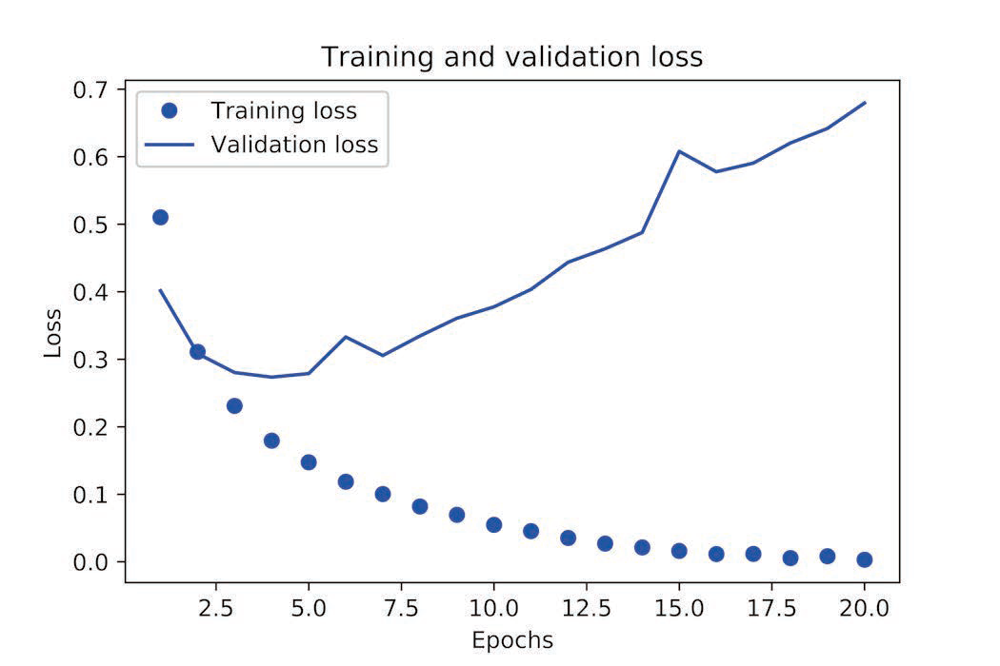

# Keras深度学习笔记

# 一 基本概念

## 1.1 机器学习基础

### 1.1.1 机器学习分类

&emsp;&emsp;机器学习根据训练数据和学习目标的关系可分为四类：

* **监督学习：**监督学习是目前最常见的机器学习类型，给定一组标注过的样本，模型将通过输入数据映射到已知目标。常用的是分类和回归（这两个都是预测，前者对离散数据预测，后者对连续数据预测）。
* **无监督学习：**无监督学习是指在没有目标的情况下寻找输入数据的有趣变换，其目的在于数据可视化、
  数据压缩、数据去噪或更好地理解数据中的相关性。常用的是降维和聚类。
* **自监督学习：**自监督学习是没有人工标注的标签的监督学习，可将它看作没有人类参与的监督学习，它是监督学习和无监督学习的过渡阶段。
* **强化学习：**使用奖惩机制，模型接收有关其环境的信息，并学会选择使某种奖励最大化。

### 1.1.2 训练集、验证集和测试集

&emsp;&emsp;开发模型时总是需要调节模型配置，即调节超参数，所以需要额外使用一部分数据（验证集）来支持该工作的进行。如果直接将数据划为训练集和测试集两部分，前者用于训练模型，后者用于评价模型并调整参数，这样将会导致模型过拟合。造成这一现象的关键在于<u>信息泄露</u>（*information leak*），每次基于模型在验证集上的性能来调节模型超参数，都会有一些关于验证数据的信息泄露到模型中。<u>训练集、验证集和测试集的配比通常6:2:2，如数据量很大（过百万）可以调整为98:1:1</u>。数据量小时，可使用<u>简单的留出验证</u>、<u>K 折验证</u>以及<u>带有打乱数据的重复K 折验证</u>。

1. **简单的留出验证（*hold-out validation*）**

&emsp;&emsp;留出一定比例的数据作为测试集。在剩余的数据上训练模型，然后在测试集上评估模型。这是最简单的评估方法，但有一个缺点：如果可用的数据很少，那么可能验证集和测试集包含的样本就太少，从而无法在统计学上代表数据。

<center>        <br>    <div style="color:orange;    display: inline-block;    color: #999;    padding: 2px;"><b>简单的留出验证数据划分</b></div> </center>
> <font color=LIGHTCORAL>**注：**上图是在测试集划分后，对训练集和测试集进行划分</font>

> **代码模板：**
>
> ```python
> num_validation_samples = 10000
> # 打乱数据
> np.random.shuffle(data)
> validation_data = data[:num_validation_samples]
> data = data[num_validation_samples:]
> training_data = data[:]
> model = get_model()
> model.train(training_data)
> validation_score = model.evaluate(validation_data)
> # 现在你可以调节模型、重新训练、评估，然后再次调节
> model = get_model()
> model.train(np.concatenate([training_data,validation_data]))
> test_score = model.evaluate(test_data)
> ```

2. **K折验证（*K-fold validation*）**

&emsp;&emsp;将数据划分为大小相同的K 个分区。对于每个分区i，在剩余的K-1 个分区上训练模型，然后在分区i 上评估模型。最终分数等于K 个分数的平均值。对于不同的训练集- 测试集划分，如果模型性能的变化很大，那么这种方法很有用。

<center>        <br>    <div style="color:orange;    display: inline-block;    color: #999;    padding: 2px;"><b>3 折验证</b></div> </center>
> **代码模板：**
>
> ```python
> k = 4
> num_validation_samples = len(data) // k
> 
> np.random.shuffle(data)
> 
> validation_scores = []
> for fold in range(k):
>     validation_data = data[num_validation_samples * fold:
>                            num_validation_samples * (fold + 1)]
>     training_data = np.concatenate([data[:num_validation_samples * fold],
>                                     data[num_validation_samples * (fold + 1):]], 
>                                     axis=0)
>     model = get_model()
>     model.train(training_data)
>     validation_score = model.evaluate(validation_data)
>     validation_scores.append(validation_score)
>     
> validation_score = np.average(validation_scores)
> 
> model = get_model()
> model.train(data)
> test_score = model.evaluate(test_data)
> ```
3. **带有打乱数据的重复K 折验证（*iterated K-fold validation with shuffling*）**

&emsp;&emsp;具体做法是多次使用K 折验证，在每次将数据划分为K 个分区之前都先将数据打乱。最终分数是每次K 折验证分数的平均值。注意，这种方法一共要训练和评估P×K 个模型（P是重复次数），计算代价很大。（**Kaggle常用**）

> <font color=LIGHTCORAL>**注：**</font>
>
> <font color=LIGHTCORAL>1. 在将数据划分为训练集和测试集
> 之前，通常应该随机打乱数据。</font>
>
> <font color=LIGHTCORAL>2.如果是时序数据，那么在划分数据前不应该随机打乱数据，因为这么做会造成时间泄露（temporal
> leak）。</font>
>
> <font color=LIGHTCORAL>3.一
> 定要确保训练集和验证集之间没有交集。</font>

### 1.1.3 数据预处理

* **向量化：**神经网络的所有输入和目标都必须是浮点数张量（在特定情况下可以是整数张量）。

* **值标准化：**一般来说，将取值相对较大的数据（比如多位整数，比网络权重的初始值大很多）或异质数据（*heterogeneous data*，比如数据的一个特征在0~1 范围内，另一个特征在100~200 范围内）输入到神经网络中是不安全的。这么做可能导致较大的梯度更新，进而导致网络无法收敛。

  输入数据应有以下特征。

  * **取值较小：**大部分值都应该在 0~1 范围内。
  * **同质性（*homogenous*）：**所有特征的取值都应该在大致相同的范围内。

* **处理缺失值：**对于神经网络，将缺失值设置为0 是安全的，只要0 不是一个有意义的值。（注：不能训练集无缺失值，而测试集有缺失值，在这种情况下，网络不可能学会忽略缺失值。）

### 1.1.4 特征工程

&emsp;&emsp;特征工程的本质：用更简单的方式表述问题，从而使问题变得更容易。它通常需要深入理解问题。

&emsp;&emsp;但对于现代深度学习，大部分特征工程都是不需要的，因为神经网络能够从原始数据中自动提取有用的特征。但也需要注重特征工程，因为：

* 良好的特征仍然可以让你用更少的资源更优雅地解决问题。
* 良好的特征可以让你用更少的数据解决问题。

### 1.1.5 过拟合和欠拟合

&emsp;&emsp;训练数据上的损失越小，测试数据上的损失也越小。这时的模型是欠拟合（*underfit*）的，即仍有改进的空间，网络还没有对训练数据中所有相关模式建模，解决方案是继续学习或增加模型复杂度。但在训练数据上迭代一定次数之后，泛化不再提高，验证指标先是不变，然后开始变差，即模型开始过拟合，最优解决方法是获取更多的训练数据或者使用正则化。

&emsp;&emsp;过拟合的解决方法：

* 获得更多数据

  * 手工获得
  * 数据增强

* 减少网络容量

  * 网络深度
  * 隐藏神经元数量

* 权重正则化

  * L1 || L2正则化

  ```python
  from keras import regularizers
  regularizers.l1(0.001) # L1正则化
  regularizers.l1_l2(l1=0.001, l2=0.001) # L2正则化
  
  model.add(layers.Dense(16, kernel_regularizer=regularizers.l2(0.001),
  activation='relu'))
  ```

* dropout正则化

  `model.add(layers.Dropout(0.5))`

### 1.1.6 机器学习一般流程

* 定义问题与要训练的数据。收集这些数据，有需要的话用标签来标注数据。
* 选择衡量问题成功的指标。你要在验证数据上监控哪些指标？
*  确定评估方法：留出验证？ K折验证？你应该将哪一部分数据用于验证？
* 开发第一个比基准更好的模型，即一个具有统计功效的模型。
* 开发过拟合的模型。
* 基于模型在验证数据上的性能来进行模型正则化与调节超参数。

## 1.2 Keras基础

### 1.2.1 层的概念

&emsp;&emsp;**简单的向量数据**保存在形状为`(samples`, `features)` 的**2D** **张量**中，通常用**密集连接层**［densely connected layer，也叫全连接层（fully connected layer）或密集层（dense layer），对应于`Keras` 的`Dense` 类］来处理。**序列数据**保存在形状为`(samples`, `timesteps`, `features) `的**3D** **张量**中，通常用循环层（recurrent layer，比如`Keras` 的`LSTM `层）来处理。**图像数据**保存在**4D 张量**中，通常用二维卷积层（`Keras` 的`Conv2D`）来处理。

```python
from keras import models
from keras import layers
# 模型中添加的层都会自动匹配输入层的形状
model = models.Sequential()
model.add(layers.Dense(32, input_shape=(784,)))
model.add(layers.Dense(32)) # 输入神经元数量为上一层的输出数量
```

### 1.2.2 损失值与优化器

&emsp;&emsp;对于**二分类问题**，可以使用**二元交叉熵**（`binary_crossentropy`）损失函数；对于**多分类问题**，可以用**分类交叉熵**（`categorical_crossentropy`）损失函数；对于**回归问题**，可以用**均方误差（mean-squared error）**损失函数；对于**序列**学习问题，可以用**联结主义时序分类（CTC**，connectionist temporal classification）损失函数，等等。

|      问题类型       | 最后一层激活 |         损失函数          |
| :-----------------: | :----------: | :-----------------------: |
|     二分类问题      |   sigmoid    |    binary_crossentropy    |
| 多分类、单标签问题  |   softmax    | categorical_crossentropy  |
| 多分类、多标签问题  |   sigmoid    |    binary_crossentropy    |
|    回归到任意值     |      无      |            mse            |
| 回归到0~1范围内的值 |   sigmoid    | mse 或binary_crossentropy |

### 1.2.3 Keras开发流程

1.  定义训练数据：输入张量和目标张量。
2. 定义层组成的网络（或模型），将输入映射到目标。

3. 配置学习过程：选择损失函数、优化器和需要监控的指标。

4. 调用模型的`fit `方法在训练数据上进行迭代。

> <font color=LIGHTCORAL>**注：**</font>
>
> <font color=LIGHTCORAL>1. 定义模型有两种方法，一种是使用`Sequential` 类（仅用于层的线性堆叠，这是目前最常见的网络架构），另一种是函数式API（functional API，用于层组成的有向无环图，让你可以构建任意形式的架构）；</font>
>
> <font color=LIGHTCORAL>2.编译模型中的优化器、损失和指标可自定义，通过`optimizer`、`loss`和`metrics`类设置。</font>

> **代码模板：**
>
> ```python
> from keras import models
> from keras import layers
> from keras import optimizers
> # Sequential 类
>  model = models.Sequential()
>  model.add(layers.Dense(32, activation='relu', input_shape=(784,)))
> model.add(layers.Dense(10, activation='softmax'))
> # 函数API定义
> input_tensor = layers.Input(shape=(784,))
> x = layers.Dense(32, activation='relu')(input_tensor)
> output_tensor = layers.Dense(10, activation='softmax')(x)
> model = models.Model(inputs=input_tensor, outputs=output_tensor)
> 
> # 编译
> model.compile(optimizer=optimizers.RMSprop(lr=0.001),
>               loss='mse',
>               metrics=['accuracy'])
> # 拟合
> model.fit(input_tensor, target_tensor, batch_size=128, epochs=10)
> 
> # 评估
> model.evaluate(x_test, y_test)
>  
> # 预测
> model.predict(x_test) # 模型精度合理，可用于实践
> ```

# 二 常见问题基本模板

## 2.1 二分类问题

> **问题描述：**预测电影评论的情绪，即电影评论分类
>
> **数据：**IMDB数据集
>
> **损失函数：**二分交叉熵（`binary_crossentropy`）
>
> **评估指标：**精度（`accuracy`）

> **代码模板：**
>
> * **模型构建与测试**
>
> ```python
> model = models.Sequential()
> model.add(layers.Dense(16, activation="relu", input_shape=(10000,)))
> model.add(layers.Dense(16, activation="relu"))
> model.add(layers.Dense(1, activation="sigmoid"))
> # 使用验证集，该验证集非test，是developement数据集，
> x_val = x_train[:10000]
> partial_x_train = x_train[10000:]
> y_val = y_train[:10000]
> partial_y_train = y_train[10000:]
> 
> model.compile(optimizer='rmsprop',
>            loss='binary_crossentropy',
>            metrics=['acc'])
> # fit方法返回一个History对象
> history = model.fit(partial_x_train,
>                  partial_y_train,
>                  epochs=20,
>                  batch_size=512,
>                  validation_data=(x_val, y_val))
> # 该对象有loss和accuracy的字典
> history_dict = history.history
> ```
> * **绘制学习曲线**
>
> ```python
> #使用matplotlib绘制训练成本图
> loss_values = history_dict['loss']
> val_loss_values = history_dict['val_loss']
> epochs = range(1, len(loss_values) + 1)
> plt.plot(epochs, loss_values, 'bo', label='Training loss')
> plt.plot(epochs, val_loss_values, 'b', label='Validation loss')
> plt.title('Training and validation loss')
> plt.xlabel('Epochs')
> plt.ylabel('Loss')
> plt.legend()
> ```
>
> <center>        <br>    <div style="color:orange;    display: inline-block;    color: #999;    padding: 2px;"><b>loss曲线</b></div> </center>
> * **绘制精度曲线**
>
> ```python
> #使用matplotlib绘制训练精度图
> acc = history_dict['acc']
> val_acc = history_dict['val_acc']
> plt.plot(epochs, acc, 'bo', label='Training acc')
> plt.plot(epochs, val_acc, 'b', label='Validation acc')
> plt.title('Training and validation accuracy')
> plt.xlabel('Epochs')
> plt.ylabel('Accuracy')
> plt.legend()
> ```
>
> <center>        <br>    <div style="color:orange;   display: inline-block;    color: #999;    padding: 2px;"><b>accuracy曲线</b></div> </center>
> > **分析：**根据两幅图，可知发生了过拟合，在第3轮时应该停止训练（或者使用其他降低过拟合的方法）
>
> * **模型调整**
>
> ```python
> model = models.Sequential()
> model.add(layers.Dense(16, activation='relu', input_shape=(10000,)))
> model.add(layers.Dense(16, activation='relu'))
> model.add(layers.Dense(1, activation='sigmoid'))
> model.compile(optimizer='rmsprop',
> loss='binary_crossentropy',
> metrics=['accuracy'])
> model.fit(x_train, y_train, epochs=4, batch_size=512)
> results = model.evaluate(x_test, y_test)
> model.predict(x_test) # 模型精度合理，可用于实践
> ```
>
> > <font color=LIGHTCORAL>**注：**</font>
> >
> > <font color=LIGHTCORAL>1. 无论你的问题是什么，`rmsprop`优化器通常都是足够好的选</font>
> >
> > <font color=LIGHTCORAL>2.当曲线不平滑时，可使用如下代码：</font>
> >
> > ```python
> > def smooth_curve(points, factor=0.8):
> >     smoothed_points = []
> >     for point in points:
> >         if smoothed_points:
> >             previous = smoothed_points[-1]
> >             smoothed_points.append(previous * factor + point * (1 - factor))
> >         else:
> >         	smoothed_points.append(point)
> >     return smoothed_points
> > ```
> >
> > 

## 2.2 多分类问题

> **问题描述：**预测新闻的主题，即对新闻进行多分类
>
> **数据：**路透社数据集
>
> **损失函数：**分类交叉熵（`categorical_crossentropy`）
>
> **评估指标：**精度（`accuracy`）

> **代码模板：**
>
> * **数据清洗—独热编码**
>
> *极大可能会用到，由于这是`Keras`笔记，故不介绍`skleran`等其他实现方法*
>
> `one_hot_train_labels = to_categorical(train_labels)`
>
> * **模型构建与测试**
>
>   <font color=gray>曲线和分析什么的同上，故不介绍，直接贴模型</font>
>
> ```python
> model = models.Sequential()
> model.add(layers.Dense(64, activation="relu", input_shape=(10000,)))
> model.add(layers.Dense(64, activation="relu"))
> model.add(layers.Dense(64, activation="relu"))
> model.add(layers.Dense(46, activation="softmax")) #输出层维数的等于独热编码的维数
> model.compile(optimizer='rmsprop',
>        loss='categorical_crossentropy',
>        metrics=['accuracy'])
> 
> x_val = x_train[:1000]
> partial_x_train = x_train[1000:]
> y_val = one_hot_train_labels[:1000]
> partial_y_train = one_hot_train_labels[1000:]
> 
> model.fit(partial_x_train,
>           partial_y_train,
>           epochs=20,
>           batch_size=512,
>           validation_data=(x_val, y_val))
> model.evaluate(x_test, one_hot_test_labels)
> ```
> > <font color=LIGHTCORAL>**注：**</font>
> >
> > <font color=LIGHTCORAL>&emsp;1.如果要对 *N*个类别的数据点进行分类，网络的最后一层应该是大小为 *N*的`Dense`层。一种合理的解释为，试图将大量信息（这些信息足够恢复 *N*个类别的分割超平面）压缩到维度很小的中间空间，从而导致信息丢失、精度下降。</font>
> >
> > <font color=LIGHTCORAL>&emsp;2. 对于单标签、多分类问题，网络的最后一层应该使用softmax 激活，这样可以输出在N个输出类别上的概率分布。</font>
> > 
> > <font color=LIGHTCORAL>&emsp;3. 这种问题的损失函数几乎总是应该使用**分类交叉熵**。它将网络输出的概率分布与目标的真实分布之间的距离最小化。</font>
> > 
> > <font color=LIGHTCORAL>&emsp;4. 处理多分类问题的标签有两种方法：</font>
> >   * <font color=LIGHTCORAL> 通过分类编码（也叫 `one-hot` 编码）对标签进行编码，然后使用` categorical_crossentropy `作为损失函数。</font>
> >   * <font color=LIGHTCORAL>*将标签编码为整数，然后使用 `sparse_categorical_crossentropy`损失函数。</font>

## 2.3 回归问题

> **问题描述：**预测房价
>
> **数据：**波士顿房价数据集
> 
> **损失函数：**均方误差（`MSE, mean squared error`）
>
> **评估指标：**平均绝对误差（`MAE, mean absolute error`）

> **代码模板：**
>
> * **数据清洗—标准化**
>
> *建模时基本会用到，这也不是回归问题的专属，前者分类问题也需用到*
>
> *<font size=2>这里只介绍如何实现，也可使用`skleran.preprocessing.StandardScaler`实现</font>*
>
> ```python
> mean = train_data.mean(axis=0)
> train_data -= mean
> std = train_data.std(axis=0)
> train_data /= std
> 
> # 虽然已知测试集，但也要用训练集的均值和标准差来计算
> test_data -= mean
> test_data /= std
> ```
>
> * **模型构建与测试**
>
> ```python
> def build_model():
>     model = models.Sequential()
>     model.add(layers.Dense(64, activation='relu',
>          input_shape=(train_data.shape[1],)))
>     model.add(layers.Dense(64, activation='relu'))
>     model.add(layers.Dense(1))
>     model.compile(optimizer='rmsprop', loss='mse', metrics=['mae'])
>     return model
> ```
> * **K折交叉验证（取决于数据量）**
>
> <center>        <br>    <div style="color:orange;    display: inline-block;    color: #999;    padding: 2px;"><b>3折交叉验证</b></div> </center>
><font color=gray>曲线和分析什么的同上，故不介绍，直接贴模型</font>
> 
>```python
> k = 4
> num_val_samples = len(train_data) // k
> num_epochs = 100
> all_scores = []
> 
> for i in range(k):
>     print("processing fold # ", i)
>     val_data = train_data[i * num_val_samples : (i + 1) * num_val_samples]
>     val_targets = train_targets[i * num_val_samples : (i + 1) * num_val_samples]
> 
>     # 合并剩下来的数据
>     partial_train_data =  np.concatenate([train_data[:i * num_val_samples],
>                         train_data[(i + 1) * num_val_samples:]],
>                         axis=0)
>     partial_train_targets =  np.concatenate([train_targets[:i * num_val_samples],
>                           train_targets[(i + 1) * num_val_samples:]],
>                           axis=0)
>     
>     model = build_model()
>     model.fit(partial_train_data, partial_train_targets,
>          epochs=num_epochs, batch_size=1, verbose=0)
>     val_mse, val_mae = model.evaluate(val_data, val_targets, verbose=0)
>     all_scores.append(val_mae)
> ```
> 
>> <font color=LIGHTCORAL>**注：**</font>
> >
> > <font color=LIGHTCORAL>&emsp;1.回归常用的损失函数为均方误差（*MSE*），常用的评估指标为平均绝对误差（*MAE*）。</font>
> >
> > <font color=LIGHTCORAL>&emsp;2.如果可用的数据很少，可使用K折验证评估模型，此时也应使用小的网络，即隐藏层较少，否则将造成过拟合。</font>

# 三 计算机视觉&卷积神经网络

## 3.1 基本概念

* **图像组成：**包含两个空间轴（**高度和宽度**）和一个深度轴（也叫作**通道**，*Channel*）的3D张量。对于黑白图（如MNIST数字图像），深度等于1，RGB图深度等于3，。

* **卷积运算（*Convolution*）：**通过卷积学到图像的局部模式，具有平移不变性（可以高效地学到局部模式）以及模式的空间层次结构（卷积从前往后能学到局部到宏观的特征）。

  对应于*Keras*的`Conv2D`层：`Conv2D(output_depth, (window_height, window_width))`

  * **尺寸：**过滤器（*Filter*）的尺寸为$$n*n*c_{l-1}$$，其中$$n$$一般为奇数，常用3、5、7等，$$c_{l-1}$$为上一层的通道数量。卷积窗口的数量作为下一层特征图的通道数。
  * ***Padding*：** 将特征图进行填充，根据padding_size，分为*Valid*卷积和*Same*卷积，前者意味着不填充，后者意味着填充以及卷积后输出的特征图尺寸和原来一样。
  * **步长（*Stride*）：**过滤器每次滑动的步幅。

<center>        <br>    <div style="color:orange;    display: inline-block;    color: #999;    padding: 2px;"><b>卷积示意图</b></div> </center>
&emsp;&emsp;卷积核运算后输出的特征图尺寸为：
$$
times (\frac{n+2p-f}{s} + 1) \times (\frac{n+2p-f}{s} + 1) \times m_{l-1}
$$
其中，$n$为图像的宽和高，$p$为padding size，$f$为过滤器的宽和高，$s$为步长，$m_{l-1}$前一层的过滤器的数量。

* **池化（*Pooling*）：**一般用**最大池化（`MaxPooling2D`）**，最大池化与卷积的最大不同之处在于，最大池化通常使用2×2 的窗口和步幅2，其目的是**将特征图下采样2 倍，即缩减一半**。用池化的原因主要有两点：1、让后面的卷积层包含更复杂的信息（学到宏观知识）；2、减少参数，防止过拟合。
* **全连接（*Dense*）：**同普通的神经网络，一般将该层放到卷积的最末，以学习宏观知识。

> **基本模板**
>
> ```python
> from keras import layers
> from keras import models
> 
> model = models.Sequential()
> # 卷积1
> model.add(layers.Conv2D(32, (3, 3), activation='relu', input_shape=(28, 28, 1)))
> model.add(layers.MaxPooling2D((2, 2)))
> # 卷积2
> model.add(layers.Conv2D(64, (3, 3), activation='relu'))
> model.add(layers.MaxPooling2D((2, 2)))
> # 卷积3
> model.add(layers.Conv2D(64, (3, 3), activation='relu'))
> #model.summary() #查看模型的架构
> 
> # 拉直
> model.add(layers.Flatten())
> # 全连接
> model.add(layers.Dense(64, activation='relu'))
> model.add(layers.Dense(10, activation='softmax'))
> 
> # 编译、训练、评价等操作同基本的神经网络
> ```

> <font color=LIGHTCORAL>**注：**网络中特征图的深度在逐渐增大（如从32 增大到128），而特征图的尺寸在逐渐减小（如从150×150 减小到7×7），这几乎是所有卷积神经网络的模式。</font>

## 3.2 CNN技巧

#### 3.2.1 数据增强

&emsp;&emsp;*Keras*中有一个图像处理辅助工具的模块，位于`keras.preprocessing.image`，它包含了一个`ImageDataGenerator`类，可以快速创建*Python*生成器，能够将硬盘上的图像文件自动转换为预处理好的张量批量，可完成一下处理：

* 读取图像；
* 将JPEG文件解码为RGB像素网格；
* 将这些像素网格转换成浮点张量；
* 将像素值缩放到[0, 1 ]区间。

&emsp;&emsp;数据增强是从现有的训练样本中生成更多的训练数据，其方法是利用多种能够生成可信图像的随机变换来**增加（*augment*）样本**。

> **使用`ImageDataGenerator`进行预处理以及数据增强**
>
> ```python
> from keras.preprocessing.image import ImageDataGenerator
> 
> train_datagen = ImageDataGenerator(
>            rescale=1./255,
>               rotation_range=40,	# （数据增强开始）， 旋转角度范围
>               width_shift_range=0.2, # 水平平移比例
>               height_shift_range=0.2, # 垂直平移比例
>               shear_range=0.2, # 随机错切角度
>               zoom_range=0.2, # 随机缩放范围
>               horizontal_flip=True, # 随机将一半图像水平翻转
> 				 fill_mode='nearest') # 处理变换时超出边界的点
> test_datagen = ImageDataGenerator(rescale=1./255) # 不能增强验证数据
> 
> train_generator = train_datagen.flow_from_directory(
>               train_dir, # 目标目录，内部应该含有子文件夹，代表类别
>               target_size=(150, 150), # 将所有图像大小调整为150*150
>               batch_size=32,
>               class_mode='binary') # 若inary_crossentropy损失，则二进制标签
> validation_generator = test_datagen.flow_from_directory(
>  				 validation_dir,
>                   target_size=(150, 150),
>                   batch_size=32,
>                   class_mode='binary')
> #############
> #model已经建好
> ############
> 
> history = model.fit_generator(
>    train_generator,
>       steps_per_epoch=100,
>       epochs=30,
>       validation_data=validation_generator,
>       validation_steps=50)
> model.save('my_model.h5')
> 
> # from keras.models import load_model
> # model = load_model('my_model.h5')
> ```

#### 3.2.2 迁移学习（预训练）

&emsp;&emsp;**预训练网络（*pretrained network*）**是一个保存好的网络，之前已经在大型数据集上训练好。使用预训练网络有两种方法：特征提取（feature extraction）和微调模型（fine-tuning）

##### 3.2.2.1 特征提取（*feature extraction*）

&emsp;&emsp;特征提取是使用之前网络学到的表示来从新样本中提取出有趣的特征。然后将这些特征输入一个新的分类器，从头开始训练。CNN由两部分组成：**卷积基（*convolutional base*）**和**密集连接分类器**。特征提取即使用原始模型的卷积基，并根据现有数据重新训练分类器。

> <font color=LIGHTCORAL>**注：**如果新数据集与原始模型训练的数据集有很大差异，那么最好只使用模型的前几层来做特征提取，而不是使用整个卷积基。</font>

<center>        <br>    <div style="color:orange;    display: inline-block;    color: #999;    padding: 2px;"><b>特征提取示意图</b></div> </center>
> 1. **基于*VGG16*以及*ImageNet*数据集的特征提取（无数据增强，直接使用原始卷积基）**
>
> ```python
> from keras.applications import VGG16
> import numpy as np
> from keras.preprocessing.image import ImageDataGenerator
> from keras import models
> from keras import layers
> from keras import optimizers
> 
> # 预训练网络
> conv_base = VGG16(weights='imagenet', # 模型初始化的权重检查点
>                   include_top=False, # 指定模型最后是否包含密集连接分类器，原始有1000个
>                   input_shape=(150, 150, 3)) # 输入到网络中的图像张量的形状，可选
> 
> # 图像预处理生成器
> datagen = ImageDataGenerator(rescale=1./255)
> batch_size = 20
> 
> # 提取特征（利用预训练的卷积基将数据进行计算处理）
> def extract_features(directory, sample_count):
>     features = np.zeros(shape=(sample_count, 4, 4, 512))
>     labels = np.zeros(shape=(sample_count))
>     generator = datagen.flow_from_directory(
>                     directory,
>                     target_size=(150, 150),
>                     batch_size=batch_size,
>                     class_mode='binary')
>     i = 0
>     for inputs_batch, labels_batch in generator:
>         features_batch = conv_base.predict(inputs_batch)
>         features[i * batch_size : (i + 1) * batch_size] = features_batch
>         labels[i * batch_size : (i + 1) * batch_size] = labels_batch
>         i += 1
>         # 生成器会一直循环，必须在读取完成所有图像后终止循环
>         if i * batch_size >= sample_count:
>         	break
>     return features, labels
> 
> # 对训练集、验证集和测试集进行特征提取
> train_features, train_labels = extract_features(train_dir, 2000)
> validation_features, validation_labels = extract_features(validation_dir, 1000)
> test_features, test_labels = extract_features(test_dir, 1000)
> 
> # 为了进行密集连接迅速按，将数据展平
> train_features = np.reshape(train_features, (2000, 4 * 4 * 512))
> validation_features = np.reshape(validation_features, (1000, 4 * 4 * 512))
> test_features = np.reshape(test_features, (1000, 4 * 4 * 512))
> 
> # 密集连接层
> model = models.Sequential()
> model.add(layers.Dense(256, activation='relu', input_dim=4 * 4 * 512))
> model.add(layers.Dropout(0.5)) # 防止过拟合
> model.add(layers.Dense(1, activation='sigmoid'))
> 
> train_features = np.reshape(train_features, (2000, 4 * 4 * 512))
> validation_features = np.reshape(validation_features, (1000, 4 * 4 * 512))
> test_features = np.reshape(test_features, (1000, 4 * 4 * 512))
> 
> model.compile(optimizer=optimizers.RMSprop(lr=2e-5),
>               loss='binary_crossentropy',
>               metrics=['acc'])
> 
> history = model.fit(train_features, train_labels,
>                     epochs=30,
>                     batch_size=20,
>                     validation_data=(validation_features, validation_labels))
> ```
>
> 2. **同1，对原始卷积基进行冻结，可用数据增强**
>
> ```python
> from keras import models
> from keras import layers
> from keras.applications import VGG16
> 
> # 预训练网络
> conv_base = VGG16(weights='imagenet', # 模型初始化的权重检查点
>                   include_top=False, # 指定模型最后是否包含密集连接分类器，原始有1000个
>                   input_shape=(150, 150, 3)) # 输入到网络中的图像张量的形状，可选
> 
> model = models.Sequential()
> model.add(conv_base) # 原始卷积基代替卷积层
> model.add(layers.Flatten())
> model.add(layers.Dense(256, activation='relu'))
> model.add(layers.Dense(1, activation='sigmoid'))
> 
> # 设置trainable进行冻结
> conv_base.trainable = False
> 
> model.compile(loss='binary_crossentropy',
>               optimizer=optimizers.RMSprop(lr=2e-5),
>               metrics=['acc'])
> 
> # 数据增强见2.1
> ```

##### 3.2.2.2 微调模型（*fine-tuning*）

&emsp;&emsp;对于用于特征提取的冻结的模型基，**微调是指将其顶部的几层“解冻”**，并将这解冻的几层和新增加的部分（如全连接分类器）联合训练。微调步骤：

1. 在已经训练好的基网络（*base network*）上添加自定义网络。

2. 冻结基网络。

3. 训练所添加的部分。

4. 解冻基网络的一些层。

5. 联合训练解冻的这些层和添加的部分。

<center>        <br>    <div style="color:orange;    display: inline-block;    color: #999;    padding: 2px;"><b>微调示意图</b></div> </center>
> **微调模型**
>
> ```python
> conv_base.trainable = True
> 
> # 一直冻结到某层
> set_trainable = False
> for layer in conv_base.layers:
>     if layer.name == 'block5_conv1':
>         set_trainable = True
>     if set_trainable:
>         layer.trainable = True
>     else:
>         layer.trainable = False
>         
> model.compile(loss='binary_crossentropy',
>               optimizer=optimizers.RMSprop(lr=1e-5), # 为了不影响冻结层，学习率较小
>               metrics=['acc'])
> 
> # 其他代码同3.2.2.1 2
> ```
>


> <font color=LIGHTCORAL>**注：**</font>
>
> <font color=LIGHTCORAL>&emsp;1.卷积基中更靠底部的层编码的是更加通用的可复用特征，而更靠顶部的层编码的是更专业化的特征。微调更靠底部的层，得到的回报会更少。</font>
>
> <font color=LIGHTCORAL>&emsp;2.训练的参数越多，过拟合的风险越大。卷积基有 1500 万个参数，所以在小型数据集上训练这么多参数是有风险的。</font>

## 3.3 CNN的可视化

&emsp;&emsp;卷起神经网络不同于其他深度学习模型，因为它是视觉概念的表示，所以非常适合可视化。

#### 3.3.1 可视化卷积神经网络的中间输出（中间激活）

&emsp;&emsp;指对于给定输入，<u>展示网络中各个卷积层和池化层输出的特征图</u>（层的输出通常被称为该层的激活，即激活函数的输出）。有助于理解卷积神经网络连续的层如何对输入进行变换，也有助于初步了解卷积神经网络每个过滤器的含义。

>**可视化已有模型以及数据**
>
>```python
>from keras.models import load_model
>from keras.preprocessing import image
>from keras import models
>import numpy as np
>import matplotlib.pyplot as plt
>
>model = load_model('cats_and_dogs_small_2.h5')
>model.summary() # 查看模型架构
>
># 预处理单张图片，并可视化图片
>img_path = '/Users/fchollet/Downloads/cats_and_dogs_small/test/cats/cat.1700.jpg'
>img = image.load_img(img_path, target_size=(150, 150))
>img_tensor = image.img_to_array(img)
>img_tensor = np.expand_dims(img_tensor, axis=0)
>img_tensor /= 255. # 归一化
>plt.imshow(img_tensor[0])
>plt.show()
>
># 使用数据将模型实例化
>layer_outputs = [layer.output for layer in model.layers[:8]] # 提取前8 层的输出
>activation_model = models.Model(inputs=model.input, outputs=layer_outputs) # 创建一个模型，给定模型输入，可以返回这些输出
>activations = activation_model.predict(img_tensor)
>
># 可视化一层 一个通道
>plt.matshow(first_layer_activation[0, :, :, 4], cmap='viridis') # 可视化第1层激活，第4个通道
>
># 可视化所有激活及其所有通道
>layer_names = [] # 层的名字，可将其画到图中
>for layer in model.layers[:8]:
>    layer_names.append(layer.name)
>images_per_row = 16 # 每行图像的个数
>for layer_name, layer_activation in zip(layer_names, activations):
>    n_features = layer_activation.shape[-1] # 特征图的信道数
>    size = layer_activation.shape[1] # 特征图的尺寸（形状为(1, size, size, n_features)）
>    n_cols = n_features // images_per_row # 一行image_per_row个，计算行数
>    display_grid = np.zeros((size * n_cols, images_per_row * size)) # 图像容器
>    for col in range(n_cols):
>        for row in range(images_per_row):
>            channel_image = layer_activation[0,
>            								 :, :,
>            								 col * images_per_row + row]
>            channel_image -= channel_image.mean()
>            channel_image /= channel_image.std()
>            channel_image *= 64
>            channel_image += 128
>            channel_image = np.clip(channel_image, 0, 255).astype('uint8')
>            display_grid[col * size : (col + 1) * size,
>            	  	 	 row * size : (row + 1) * size] = channel_image
>        scale = 1. / size
>        plt.figure(figsize=(scale * display_grid.shape[1],
>        					scale * display_grid.shape[0]))
>        plt.title(layer_name)
>        plt.grid(False)
>        plt.imshow(display_grid, aspect='auto', cmap='viridis')
>```
>
><center>        <br>    <div style="color:orange;    display: inline-block;    color: #999;    padding: 2px;"><b>激活层所有信道可视化</b></div> </center>

#### 3.3.2 可视化卷积神经网络的过滤器

&emsp;&emsp;有助于精确理解卷积神经网络中每个过滤器容易接受的视觉模式或视觉概念。

>**以VGG16为例**
>
>```python
>import numpy as np
>import matplotlib.pyplot as plt
>from keras.applications import VGG16
>from keras import backend as K
>
># 得到图像张量取值可能不是[0, 255]内的整数，需要对其放缩
>def deprocess_image(x):
>    x -= x.mean()
>    x /= (x.std() + 1e-5)
>    x *= 0.1
>
>    x += 0.5
>    x = np.clip(x, 0, 1)
>
>    x *= 255
>    x = np.clip(x, 0, 255).astype("uint8")
>    return x
>
># 损失函数，将该层第n个过滤器的激活最大化
>def generate_pattern(layer_name, filter_index, size=150):
>    layer_output = model.get_layer(layer_name).output
>    loss = K.mean(layer_output[:, :, :, filter_index])
>
>    grads = K.gradients(loss, model.input)[0] # 计算这个损失相对于输入图像的梯度
>
>    grads /= (K.sqrt(K.mean(K.square(grads))) + 1e-5) # 标准化技巧：将梯度标准化
>
>    iterate = K.function([model.input], [loss, grads]) # 返回给定输入图像的损失和梯度
>	
>    #从带有噪声的灰度图像开始
>    input_img_data = np.random.random((1, size, size, 3)) * 20 + 128.
>
>    step = 1.
>    for i in range(40):
>        loss_value, grads_value = iterate([input_img_data])
>        input_img_data += grads_value * step
>        
>    img = input_img_data[0]
>    return deprocess_image(img)
>
># 生成某一层中所有过滤器响应模式组成的网格
>layer_name = 'block1_conv1'
>size = 64
>margin = 5
>
># 空图像（全黑色），用于保存结果
>results = np.zeros((8 * size + 7 * margin, 8 * size + 7 * margin, 3))
>for i in range(8): # 遍历results 网格的行 
>    for j in range(8): # 遍历results 网格的列
>        filter_img = generate_pattern(layer_name, i + (j * 8), size=size)
>
>        horizontal_start = i * size + i * margin
>        horizontal_end = horizontal_start + size
>        vertical_start = j * size + j * margin
>        vertical_end = vertical_start + size
>        results[horizontal_start: horizontal_end,
>            vertical_start: vertical_end, :] = filter_img
>results = results.astype("int")
>
>plt.figure(figsize=(20, 20))
>plt.imshow(results)
>```
>
><center>        <br>    <div style="color:orange;    display: inline-block;    color: #999;    padding: 2px;"><b>block1_conv1 层的过滤器模式</b></div> </center>

#### 3.3.3 可视化图像中类激活的热力图

&emsp;&emsp;有助于理解图像的哪个部分被识别为属于某个类别，从而可以定位图像中的物体。这种通用的技术叫作**类激活图**（*CAM，class activation map*）可视化，它是指对输入图像生成类激活的热力图。通俗点，就是展示哪个部分对预测结果的贡献度最大。

>**以VGG16以及非洲象图片为例**
>
>```python
>from keras.preprocessing import image
>from keras.applications import VGG16
>from keras.applications.vgg16 import preprocess_input, decode_predictions
>import cv2
>
>model = VGG16(weights="imagenet")
>
># 加载图片，并将其处理成符合模型的结构
>img_path = "creative_commons_elephant.jpg"
>img = image.load_img(img_path, target_size=(224, 224))
>x = image.img_to_array(img)
>x = np.expand_dims(x, axis=0)
>x = preprocess_input(x)
># 测试VGG16是否能预测
>preds = model.predict(x)
>print('Predicted:', decode_predictions(preds, top=3)[0])
>
>african_elephant_output = model.output[:, 386] # 预测向量中的“非洲象”元素
>
>last_conv_layer = model.get_layer('block5_conv3') # VGG16的最后一个卷积层
>
>grads = K.gradients(african_elephant_output, last_conv_layer.output)[0]
>
>pooled_grads = K.mean(grads, axis=(0, 1, 2)) # 形状为(512,) 的向量，每个元素是特定特征图通道的梯度平均大小
>
>iterate = K.function([model.input],
>       [pooled_grads, last_conv_layer.output[0]])
>
>pooled_grads_value, conv_layer_output_value = iterate([x])
>
>for i in range(512):
>conv_layer_output_value[:, :, i] *= pooled_grads_value[i]
>
># 得到的特征图的逐通道平均值即为类激活的热力图
>heatmap = np.mean(conv_layer_output_value, axis=-1)
>
>heatmap = np.maximum(heatmap, 0)
>heatmap /= np.max(heatmap)
>plt.matshow(heatmap)
>
>img = cv2.imread(img_path)
>heatmap = cv2.resize(heatmap, (img.shape[1], img.shape[0])) # 将热力图的大小调整为与原始图像相同
>heatmap = np.uint8(255 * heatmap) # 将热力图转换为RGB格式
>heatmap = cv2.applyColorMap(heatmap, cv2.COLORMAP_JET) # 将热力图应用于原始图像
>superimposed_img = heatmap * 0.4 + img # 0.4 是热力图强度因子
>plt.imshow(superimposed_img.astype("int"))
>```
>
><center>        <br>    <div style="color:orange;    display: inline-block;    color: #999;    padding: 2px;"><b>热力图</b></div> </center>
>
><font color=LIGHTCORAL>**注：**小象耳朵的激活强度很大，这可能是网络找到的非洲象和印度象的不同之处。</font>

# 四 文本和序列&循环神经网络

## 4.1处理文本数据并用普通网络训练

&emsp;&emsp;深度学习模型不会接受原始文本作为输入，只能够处理**数值张量**。将文本转换成数值张量需要**分词**（*tokenization*），即将文本分解而成单元（单词、字符或*n-gram*）或**标记**（*token*）。有两张常用的分词方法：**one-hot编码[*one-hot encoding*]**与**标记嵌入[*token embedding*]**（或叫**词嵌入**）。

<center>        <br>    <div style="color:orange;    display: inline-block;    color: #999;    padding: 2px;"><b>分词过程</b></div> </center>

> **以*aclImdb*数据为例**
>
> ```python
> import os
> import numpy as np
> from keras.preprocessing.text import Tokenizer
> from keras.preprocessing.sequence import pad_sequences
> from keras.models import Sequential
> from keras.layers import Embedding, Flatten, Dense
> import matplotlib.pyplot as plt
> 
> # 创建训练集和验证集
> imdb_dir = "aclImdb"
> train_dir = os.path.join(imdb_dir, "train")
> 
> labels = []
> texts = []
> 
> for label_type in ["neg", "pos"]:
>     dir_name = os.path.join(train_dir, label_type)
>     for fname in os.listdir(dir_name):
>         if fname[-4:] == ".txt":
>             f = open(os.path.join(dir_name, fname), encoding='UTF-8')
>             texts.append(f.read())
>             f.close()
>             if label_type == "neg":
>                 labels.append(0)
>             else:
>                 labels.append(1)
> 
> maxlen = 100 # 在100个单词后截断评论
> training_samples = 200 # 在200个样本上训练
> validation_samples = 10000 # 在10000个样本上验证
> max_words = 10000 # 只考虑数据集中前10000个最常见的单词
> 
> # 分词
> tokenizer = Tokenizer(num_words=max_words)
> tokenizer.fit_on_texts(texts)
> sequences = tokenizer.texts_to_sequences(texts)
> 
> word_index = tokenizer.word_index
> print("Found %s unique tokens." % len(word_index))
> 
> data = pad_sequences(sequences, maxlen=maxlen)
> 
> labels = np.asarray(labels)
> print("Shape of data tensor:", data.shape)
> print("Shape of label tensor:", labels.shape)
> 
> indices = np.arange(data.shape[0]) # 打乱数据
> np.random.shuffle(indices)
> data = data[indices]
> labels = labels[indices]
> 
> x_train = data[:training_samples]
> y_train = labels[:training_samples]
> x_val = data[training_samples: training_samples + validation_samples]
> y_val = labels[training_samples: training_samples + validation_samples]
> 
> # 使用已有的词嵌入权重
> glove_dir = "glove.6B"
> 
> embeddings_index = {}
> f = open(os.path.join(glove_dir, "glove.6B.100d.txt"), encoding="utf8")
> for line in f:
>     values = line.split()
>     word = values[0]
>     coefs = np.asarray(values[1:], dtype="float32")
>     embeddings_index[word] = coefs
> f.close()
> 
> print("Found %s word vectors." % len(embeddings_index))
> 
> embedding_dim = 100
> 
> embedding_matrix = np.zeros((max_words, embedding_dim))
> for word, i in word_index.items():
>     if i < max_words:
>         embedding_vector = embeddings_index.get(word)
>         if embedding_vector is not None:
>             embedding_matrix[i] = embedding_vector
>             
> # 构建模型
> model = Sequential()
> model.add(Embedding(max_words, embedding_dim, input_length=maxlen))
> model.add(Flatten())
> model.add(Dense(32, activation='relu'))
> model.add(Dense(1, activation='sigmoid'))
> model.summary()
> 
> # 将已有词嵌入权重替换第一层权重
> model.layers[0].set_weights([embedding_matrix])
> # 冻结
> model.layers[0].trainable = False
> 
> # 训练
> model.compile(optimizer='rmsprop',
>               loss='binary_crossentropy',
>               metrics=['acc'])
> history = model.fit(x_train, y_train,
>                     epochs=10,
>                     batch_size=32,
>                     validation_data=(x_val, y_val))
> model.save_weights('pre_trained_glove_model.h5')
> ```

## 4.2 基本概念

&emsp;&emsp;**循环神经网络（*RNN，recurrent neural network*）**是一类有内部环的神经网络，将一个序列看做单个数据点，即网络的单个输入，并在网络内部对序列元素进行遍历。其思想有点像马尔科夫。

> **简单RNN的Numpy实现**
>
> ```python
> import numpy as np
> 
> timesteps = 100 # 输入序列的时间步数
> input_features = 32 # 输入特征空间的维度
> output_features = 64 # 输出特征空间的维度
> 
> inputs = np.random.random((timesteps, input_features)) # 输入数据：随机噪声，仅作为示例
> 
> state_t = np.zeros((output_features,)) # 初始状态：全零向量
> 
> # 创建随机的权重矩阵
> W = np.random.random((output_features, input_features))
> U = np.random.random((output_features, output_features))
> b = np.random.random((output_features,))
> 
> successive_outputs = []
> for input_t in inputs: # input_t 是形状为(input_features,) 的向量
>     # 由输入和当前状态（前一个输出）计算得到当前输出
>     output_t = np.tanh(np.dot(W, input_t) + np.dot(U, state_t) + b)
>     # 将这个输出保存到一个列表中
>     successive_outputs.append(output_t)
>     # 更新网络的状态，用于下一个时间步
>     state_t = output_t
> 
> # 最终输出是一个形状为(timesteps, output_features) 的二维张量
> final_output_sequence = np.stack(successive_outputs, axis=0)
> ```
>
> <center>        <br>    <div style="color:orange;    display: inline-block;    color: #999;    padding: 2px;"><b>简单的RNN示意</b></div> </center>
>
> <font color=LIGHTCORAL>**注：**虽然每个时刻都会输出信息，但多数情况下只需要最后一个输出，即循环结束时的output_t。</font>

>**利用`Keras`的`SimpleRNN`层对imdb数据进行预测**
>
>```python
>from keras.models import Sequential
>from keras.layers import Embedding, SimpleRNN
>from keras.datasets import imdb
>from keras.preprocessing import sequence
>
>max_features = 10000 # 作为特征的单词个数
>maxlen = 500 # 在这么多单词后截断文本
>batch_size = 32
>
>print('Loading data...')
>(input_train, y_train), (input_test, y_test) = imdb.load_data(
>num_words=max_features)
>print(len(input_train), 'train sequences')
>print(len(input_test), 'test sequences')
>print('Pad sequences (samples x time)')
>input_train = sequence.pad_sequences(input_train, maxlen=maxlen)
>input_test = sequence.pad_sequences(input_test, maxlen=maxlen)
>print('input_train shape:', input_train.shape)
>print('input_test shape:', input_test.shape)
>
>model = Sequential()
>model.add(Embedding(max_features, 32))
>model.add(SimpleRNN(32))
>model.add(Dense(1, activation='sigmoid'))
>model.compile(optimizer='rmsprop', loss='binary_crossentropy', metrics=['acc'])
>history = model.fit(input_train, y_train,
>                    epochs=10,
>                    batch_size=128,
>                    validation_split=0.2)
>```
>
><font color=LIGHTCORAL>**注：**因为SimpleRNN不擅长处理长序列，因此该效果并不好。</font>

&emsp;&emsp;**长短期记忆(*LSTM, long short-term memory*)**是*SimpleRNN*的一个变体，它增加了一种携带信息跨越多个时间步的方法，即增加了一个携带轨道

> **LSTM架构的Numpy伪代码**
>
> ```python
> output_t = activation(dot(state_t, Uo) + dot(input_t, Wo) + dot(C_t, Vo) + bo)
> 
> i_t = activation(dot(state_t, Ui) + dot(input_t, Wi) + bi)
> f_t = activation(dot(state_t, Uf) + dot(input_t, Wf) + bf)
> k_t = activation(dot(state_t, Uk) + dot(input_t, Wk) + bk)
> 
> c_t+1 = i_t * k_t + c_t * f_t
> ```
>
> <center>        <br>    <div style="color:orange;    display: inline-block;    color: #999;    padding: 2px;"><b>LSTM示意</b></div> </center>

> **Keras实现LSTM**
>
> ```python
> from keras.layers import LSTM
> 
> model = Sequential()
> model.add(Embedding(max_features, 32))
> model.add(LSTM(32))
> model.add(Dense(1, activation='sigmoid'))
> model.compile(optimizer='rmsprop',
>               loss='binary_crossentropy',
>               metrics=['acc'])
> history = model.fit(input_train, y_train,
>                     epochs=10,
>                     batch_size=128,
>                     validation_split=0.2)
> ```


> Author：钱小z
>
> Email：qz_gis@163.com
>
> Bio：GISer，Spatiotemporal data mining
>
> GItHub：QianXzhen